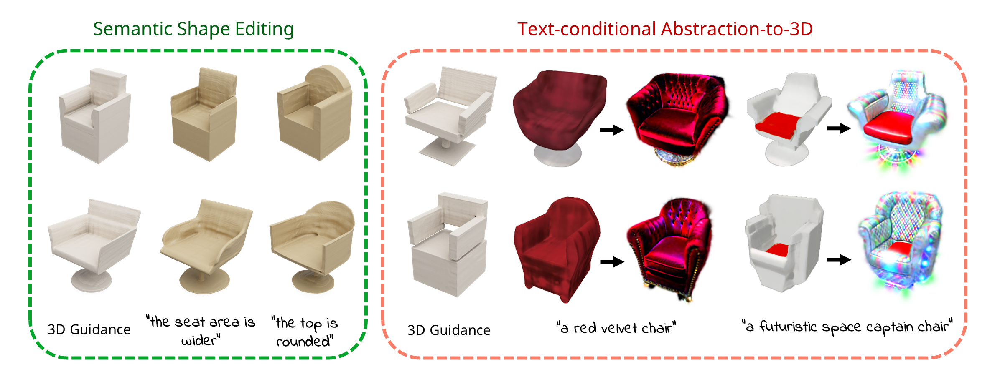

# Spice·E: Structural Priors in 3D Diffusion using Cross-Entity Attention

This is the official pytorch implementation of Spice·E.

[[Project Website](https://tau-vailab.github.io/Spice-E/)]
> **Spice·E: Structural Priors in 3D Diffusion using Cross-Entity Attention** 
> Etai Sella*, Gal Fiebelman*, Noam Atia, Hadar Averbuch-Elor 
> Tel Aviv University 
>\* Denotes equal contribution

>**Abstract**  
> We are witnessing rapid progress in automatically generating and manipulating
3D assets due to the availability of pretrained text-to-image diffusion
models. However, time-consuming optimization procedures are required
for synthesizing each sample, hindering their potential for democratizing
3D content creation. Conversely, 3D diffusion models now train on millionscale
3D datasets, yielding high-quality text-conditional 3D samples within
seconds. In this work, we present Spice·E – a neural network that adds
structural guidance to 3D diffusion models, extending their usage beyond
text-conditional generation. At its core, our framework introduces a crossentity
attention mechanism that allows for multiple entities—in particular,
paired input and guidance 3D shapes—to interact via their internal representations
within the denoising network.We utilize this mechanism for learning
task-specific structural priors in 3D diffusion models from auxiliary guidance
shapes.We show that our approach supports a variety of applications, including
3D stylization, semantic shape editing and text-conditional abstractionto-
3D, which transforms primitive-based abstractions into highly-expressive shapes. Extensive experiments demonstrate that Spice·E achieves SOTA performance over these tasks while often being considerably faster than
alternative methods. Importantly, this is accomplished without tailoring our approach for any specific task. We will release our code and trained models.

  

 

# Getting Started

## Getting the repo
    git clone git@github.com:TAU-VAILab/Spice-E.git
    cd Spice-E

 

## Setting up environment
    conda create --name Spice-E python=3.10 --yes
    conda activate Spice-E
    pip install -e .

 

## Setting up blender
1) Get 'blender-3.4.1-linux-x64.tar.xz' from [here](https://mirrors.aliyun.com/blender/release/Blender3.4/).
2) Unzip it
3) Set your BLENDER_PATH environment by running:  
`export BLENDER_PATH=\<path to your unzipped blender-3.4.1-linux-x64.tar.xz file\>/blender`  

## Running The Demo
Download the "spice_e_abstract_to_3d_chair" model (around 2.5 GB) from [here](https://drive.google.com/file/d/1c28-u-wY9GGnBeVblgSgGCELk5FHaU05/view?usp=sharing). 
For the demo using an already encoded guidance shape, run:

    python3 run_inference.py -m <path to downloaded chair model> -d demo/latent_inference/demo_latent.pt -o outputs -p "funky swivel chair"

 

For the demo using an guidance shape that is not yet encoded, run:

    python3 run_inference.py -m <path to downloaded chair model> -d demo/object_inference/ -o outputs -p "funky swivel chair" --encode_guidance --input_guidance_object_path demo/object_inference/demo_guidance_shape.ply
 

When finished you should see a 360 rendering video of the output in:

    Spice-E/outputs/funky_swivel_chair/output/output.mp4
 

# General Usage

## Getting the trained models
All the trained models used in the paper can be downloaded from [here](https://drive.google.com/drive/folders/1CxUk7BVvjPuTP5p2IMvwfjjG3s7hm2kS?usp=sharing) 
 

## Creating a latent dataset
We show an example script for creating a latent dataset for the 3D Stylization task. 
To create a latent dataset for the 3D Stylization task with refined annotations, download the finetuned blip model dir from [here](https://drive.google.com/drive/folders/1MnFKZMChZrx3BWxNWvXjjfB7rMWoqMr3?usp=sharing) and run:

    python3 get_stylization_latents.py -o <path to output folder> --use_blip_refinement --blip_model_path <path to downloaded finetuned blip model dir> --make_gray -n <number of objects trying to download in total>
 
For the text-conditional abstraction-to-3D dataset we used code from the [CuboidAbstractionViaSeg](https://github.com/SilenKZYoung/CuboidAbstractionViaSeg) repo and for the semantic shape editing dataset we used code from the [changeit3d](https://github.com/optas/changeit3d) repo. 

## Training a Spice-E model
We show an example script for training a Spice-E model for the 3D Stylization task. First, split the downloaded objects (a folder per object) from the previous step into test and train folders. To train a Spice-E model for the 3D Stylization task, run:

    python3 train_spice.py -d <path to data folder with train/test folders> -o <path to output folder> -b <batch size (must be at most the size of the smaller between your train and test set)>

## Inference
To infer from a trained Spice-E model using latents that were encoded using the Shap-E encoder, run:

    python3 run_inference.py -m <path to model> -d <path to the guidance shape latent> -o <path to output folder> -p <text prompt>

To infer from a trained Spice-E model using a 3D guidance shape that has not been encoded using the Shap-E encoder, run:

    python3 run_inference.py -m <path to model> -d <path to folder in which to save the encoded guidance shape latent> -o <path to output folder> -p <text prompt> --encode_guidance --input_guidance_object_path <path to input 3D guidance shape>

 

## BibTeX
If you find our work useful in your research, please consider citing:

    @article{sella2023spic,
     title={Spice-E : Structural Priors in 3D Diffusion using Cross-Entity Attention},
     author={Etai Sella and Gal Fiebelman and Noam Atia and Hadar Averbuch-Elor},
     year={2024},
     eprint={2311.17834},
     archivePrefix={arXiv},
     primaryClass={cs.CV}
    }
    
 

# Acknowledgements

We thank the authors of [Shap-E](https://github.com/openai/shap-e) for their wonderful code on which we base our own.
