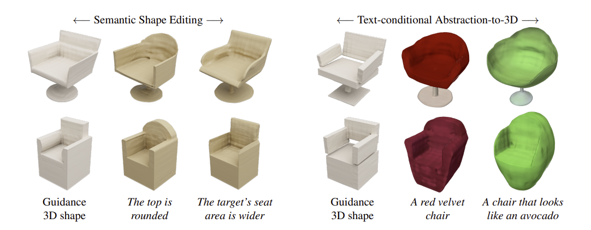

# SPiC-E: Structural Priors in 3D Diffusion Models using Cross-Entity Attention

This is the official pytorch implementation of SPiC-E.

[[Project Website](https://tau-vailab.github.io/spic-e/)]
> **SPiC-E: Structural Priors in 3D Diffusion Models using Cross-Entity Attention** 
> Etai Sella*, Gal Fiebelman*, Noam Atia, Hadar Averbuch-Elor 
> Tel Aviv University 
>\* Denotes equal contribution

>**Abstract**  
> We are witnessing rapid progress in automatically generating and manipulating 3D assets due to the availability of pretrained text-image diffusion models. However, time-consuming optimization procedures are required for synthesizing each sample, hindering their potential for democratizing 3D content creation. Conversely, 3D diffusion models now train on million-scale 3D datasets, yielding high-quality text-conditional 3D samples within seconds. In this work, we present SPiC·E - a neural network that adds structural guidance to 3D diffusion models, extending their usage beyond text-conditional generation. At its core, our framework introduces a cross-entity attention mechanism that allows for multiple entities (in particular, paired input and guidance 3D shapes) to interact via their internal representations within the denoising network. We utilize this mechanism for learning task-specific structural priors in 3D diffusion models from auxiliary guidance shapes. We show that our approach supports a variety of applications, including 3D stylization, semantic shape editing and text-conditional abstraction-to-3D, which transforms primitive-based abstractions into highly-expressive shapes. Extensive experiments demonstrate that SPiC·E achieves SOTA performance over these tasks while often being considerably faster than alternative methods. Importantly, this is accomplished without tailoring our approach for any specific task.

  

 

# Getting Started

## Getting the repo
    git clone git@github.com:TAU-VAILab/spic-e.git
    cd spic-e

 

## Setting up environment
    conda create --name spic-e python=3.10 --yes
    conda init bash
    conda activate spic-e
    pip install -e .
    pip install pyyaml
    pip install ipywidgets
    yes | apt-get update
    yes | apt-get install xvfb
    yes | apt install screen

 

## Setting up blender
1) Get 'blender-3.4.1-linux-x64.tar.xz' from [here](https://mirrors.aliyun.com/blender/release/Blender3.4/).
2) Unzip it
3) Set your BLENDER_PATH environment by running:  
`export BLENDER_PATH=\<path to your unzipped blender-3.4.1-linux-x64.tar.xz file\>/blender`  

## Running The Demo
Download the text-conditional abstraction-to-3D "chair" model from [here](https://drive.google.com/drive/folders/1EaB4SYMNTIdNG3rS8KTylhXNJVL2ljr8?usp=sharing). 
For the demo using an already encoded guidance shape, run:

    python3 run_inference.py -m <path to downloaded chair model> -d demo/latent_inference/demo_latent.pt -o outputs -p "funky swivel chair"

 

For the demo using an guidance shape that is not yet encoded, run:

    python3 run_inference.py -m <path to downloaded chair model> -d demo/object_inference/ -o outputs -p "funky swivel chair" --encode_guidance --input_guidance_object_path demo/object_inference/demo_guidance_shape.ply
 

When finished you should see a 360 rendering video of the output in:

    spic-e/outputs/funky_swivel_chair/output/output.mp4
 

# General Usage

## Getting the trained models
All the trained models used in the paper can be downloaded from [here](https://drive.google.com/drive/folders/1cc2WWV8F_wX3NUpCtEzyLjySiUmQePue?usp=sharing) 
 

## Creating a latent dataset
We show an example script for creating a latent dataset for the 3D Stylization task. 
To create a latent dataset for the 3D Stylization task, run:

    python3 get_stylization_latents.py -o <path to output folder>

To create a latent dataset for the 3D Stylization task with refined annotations, download the finetuned blip model dir from [here](https://drive.google.com/drive/folders/1lxtIL2aLGqJe2foZwoz91nlVu1LOUlRL?usp=sharing) and run:

    python3 get_stylization_latents.py -o <path to output folder> --use_blip_refinement --blip_model_path <path to downloaded finetuned blip model dir>
 
For the text-conditional abstraction-to-3D dataset we used code from the [CuboidAbstractionViaSeg](https://github.com/SilenKZYoung/CuboidAbstractionViaSeg) repo and for the semantic shape editing dataset we used code from the [changeit3d](https://github.com/optas/changeit3d) repo. 

## Training a SPiC-E model
We show an example script for training a SPiC-E model for the 3D Stylization task. To train a SPiC-E model for the 3D Stylization task, run:

    python3 train_spice.py -d <path to data folder> -o <path to output folder>

## Inference
To infer from a trained SPiC-E model using latents that were encoded using the Shap-E encoder, run:

    python3 run_inference.py -m <path to downloaded chair model> -d <path to the guidance shape latent> -o <path to output folder> -p <text prompt>

To infer from a trained SPiC-E model using a 3D guidance shape that has not been encoded using the Shap-E encoder, run:

    python3 run_inference.py -m <path to downloaded chair model> -d <path to folder in which to save the encoded guidance shape latent> -o <path to output folder> -p <text prompt> --encode_guidance --input_guidance_object_path <path to input 3D guidance shape>

 

## BibTeX
If you find our work useful in your research, please consider citing:

    @article{sella2023spic,
     title={SPiC-E: Structural Priors in 3D Diffusion Models using Cross Entity Attention},
     author={Sella, Etai and Fiebelman, Gal and Atia, Noam and Averbuch-Elor, Hadar},
     journal={arXiv preprint arXiv:2311.17834},
     year={2023}
    }
    
 

# Acknowledgements

We thank the authors of [Shap-E](https://github.com/openai/shap-e) for their wonderful code on which we base our own.
